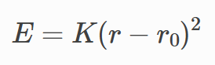
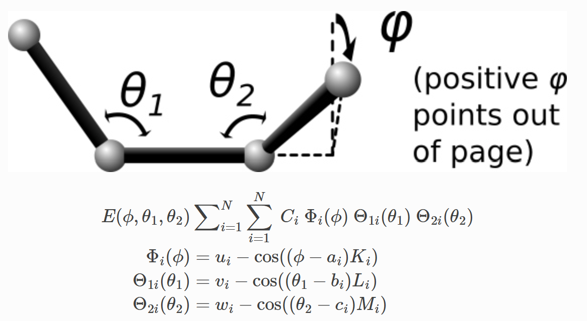
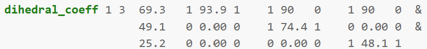
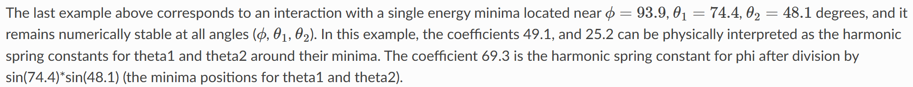

# LAMMPSStructures

## Intro to the Extended Version

This package makes the setup of highly-customizable LAMMPS simulations of complex elastic structures simple. Its main purpose is to abstract away from the minutia of LAMMPS primitives to the FEA-inspired world of structures defined by nodes and connections between nodes.

This project was forked from the original LAMMPSStructures (https://github.com/adguerra/LAMMPSStructures), written by Arman Guerra. This extension provides a new, more general framework for defining elastic structures in LAMMPS, as well as direct integration with LAMMPS and the visualization software Ovito via python - amounting to a substantial overhaul. Changes made were designed with backwards compatibility in mind - scripts using the previous version should still run identically (albeit with deprecation warnings for certain replaced methods).

As a high-level overview, the lammps_simulation.py module contains a Simulation class processing lammps-specific data to create an input file (typically called in.main_file) for lammps to run. The new run_lammps() method can then be called to run the lammps simulation using that created file, and the output rendered programmatically with the lammps_render.py module using ovito's python package. The new lammps_structure.py module contains Structure, Node, Element, etc. classes to define large-scale frame-like elastic objects. Patterning methods and the ability to specify an element's shape using parametric equations make creating complicated geometry easy. Discretization methods then break the structure up into LAMMPS atoms connected by bonds, and the lammps_simulation.py methods can be applied directly to discretized structures.

The example and validation simulations mentioned in the original project's readme (below), the project file structure, and most of the lammps_simulation.py module are part of the original LAMMPSStructures project.
The lammps_structure.py, lammps_render.py, lammps_bond_styles.py, and lammps_utils.py modules, as well as the add_atoms(), apply_node_constraints(), add_bond_types(), add_bonds(), and run_lammps() methods in lammps_simulation.py are new additions, as well as the examples and validation simulations within the lammpsWithPython folder.

## Getting Started & Reproducing Results

To get started, clone the repository, navigate to the env_setup folder, and in a terminal enter the commands:

conda env create -f environment.yaml
conda activate lammps-env-1

This creates and activates a conda environment called 'lammps-env-1' - please edit the name of the environment in the environment.yaml file if there is already a different lammps-env-1.

To run the examples in LAMMPSStructures/examples, navigate to the directory and run the python script (ie. from examples/mushroom, enter the command 'python mushroom.py mushroom_sim_1'). Some examples, like this mushroom script, require an argument for the simulation name - a folder with this name will be created to hold simulation files.

## Validation

 The proper choice of additional bond parameters ought to be justified on a case-by-case basis. Here basic 2-atom bonds and 4-atom dihedral potentials are applied by default - agreement with axial stretching and classic beam-bending formula validate their use. To hold the structure together, default bonds are applied based on the specified material and xsection properties:
 
 - A harmonic two-atom bond potential is used for axial stiffness:

    

    https://docs.lammps.org/bond_harmonic.html

    The default stiffness applied is K = Young's Modulus * atom_diameter**2 / (2*rest_length), as validated in the original LAMMPSStructures. This bond is applied to adjacent atoms in every element, as well as to end-element atoms and the atom of a neighboring node.

 - An 'angle cosine delta' three-atom bond is defined for adding bending stiffness between element pairs at nodes:

    

    https://docs.lammps.org/angle_cosine_delta.html

    By default this is not applied internally - the bending rigidity is included in the dihedral spherical potential for numeric stability. The default angular stiffness, when applied between elements at nodes, is K = Young's Modulus * atom_diameter**4 / (12*rest_length), as validated in the original LAMMPSStructures.

 - A 'dihedral spherical' four-atom bond adds bending rigidity and out-of-plane bending stiffness for parametricly-defined elements:

    

    https://docs.lammps.org/dihedral_spherical.html

    The default potential applied to enforce bending rigidity follows the form of the second example in the lammps documentation:

    

    

    The rest planar angles and rest dihedral angle are calculated from the atom coordinates, and the same angular stiffness as for the angle cosine delta potential is used for the planar angle stiffness. As a basic default, the dihedral stiffness is set to 0.2 times this angular stiffness for curved elements, and 0 for straight elements. Since this increases the energy in the system, greater viscosity is needed in some cases for convergence.

Current work lies in not only validating the correct creation of the lammps input file, but in also fine-tuning the default dihedral stiffness parameter to more closely model the behavior of curved beams.

## ME 700 - Applied Skills

● Github project structuring and management

● Coding environment setup and automation (bash script)

● Modular, object-oriented programming in python

● Thorough exception handling - Writing robust code

● Useful and concise documentation with standard formatting

● Analyzing and expand upon code written by others

● Interfacing with large open-source simulation software

● Simulation validation using problems with analytical solutions

● Debugging strategies (particularly using VS Code)

● Standard FEA geometry setup - ie. definition with nodes, elements, materials, etc.

## End Extended Version readme
The following sections of the readme is left unchanged from the original LAMMPSStructures, for easy reference. Future consolidation will see these sections merged.

## Intro

The goal of this repository is to document and provide some examples for a python package which facilitates the use of [LAMMPS](https://www.lammps.org/#gsc.tab=0) as a simulation tool for elastic materials. This python package does not simulate things on its own, rather, it contains a class and functions that allow you to write a set of files which can then be run with LAMMPS.

Elastic structures are traditionally simulated using a finite element software, which has the benefit that it can model complex geometries. However, often these softwares have a very hard time modeling contact and other complex boundary conditions. For some examples, when roots dig into soil, when cells jam on the surface of the Extra-Cellular Matrix, or when birds build a nest, there is a coupling either between many elastic bodies in contact, or between granular and elastic materials. These would all be very hard to simulate using a finite element software.

On the other hand, LAMMPS, a Discrete Element simulation software, is excellent at handling contact at the expense of geometrical complexity -- almost everything is treated as a sphere. In a couple of recent papers [[1](https://arxiv.org/abs/2209.05660),[2](https://arxiv.org/abs/2210.11324),[3](https://pubs.rsc.org/en/content/articlelanding/2021/sm/d1sm00787d),[4](https://pubs.rsc.org/en/content/articlehtml/2022/sm/d2sm01010k),[5](https://papers.ssrn.com/sol3/papers.cfm?abstract_id=4169246)], I and others have shown that it is possible to get the best of both worlds. By "gluing" spheres together to form some simple geometries that can be endowed with elastic properties, we can have contact and elasticity in the same simulation. This repository, I hope, should contain everything you need to start doing this yourself.

## Brief Tour

We have three main directories in this repo:

 - `lammps_pypack`: This contains the python package that we will use to make the files that will allow us to simulate elastic and granular materials
 - `examples`: These are some examples of this package being used in action. Some of these examples are systems that we have studied in specific publications, but others are just examples that we thought would be intersting for future study, or which display the capacity of this tool.
 - `validation`: Here there are some simulations which we validate either theoretically or against other simulations in COMSOL. This directory is comparatively scant, just because we have also performed validation as part of some of the studies cited earlier which use this tool [1](https://arxiv.org/abs/2209.05660),[2](https://arxiv.org/abs/2210.11324),[3](https://pubs.rsc.org/en/content/articlelanding/2021/sm/d1sm00787d),[4](https://pubs.rsc.org/en/content/articlehtml/2022/sm/d2sm01010k),[5](https://papers.ssrn.com/sol3/papers.cfm?abstract_id=4169246)

 There are also some files which you might find useful:

- `Documentation.md`: A brief description of all of the functions available in the `lammpsWithPython.lammps_object` tool. More thorough descriptions are given in the actual function definitions
- `CITATION.cff`: You can cite this if you use this tool in an academic setting. If you use simulations that are similar to any of the simulations in these publications [1](https://arxiv.org/abs/2209.05660),[2](https://arxiv.org/abs/2210.11324),[3](https://pubs.rsc.org/en/content/articlelanding/2021/sm/d1sm00787d),[4](https://pubs.rsc.org/en/content/articlehtml/2022/sm/d2sm01010k),[5](https://papers.ssrn.com/sol3/papers.cfm?abstract_id=4169246), then cite the publication as well.

 ## How to use this tool

To begin to use this tool, clone this repository and `pip install lammpsWithPython` from within the `lammps_pypack` folder. You can then run an example file, or make a new file which sets up some simulation that you make. 

Any time you use this tool, it will create a new folder with a name that you specify, and within that folder, it will write some files that LAMMPS will need to run a simulation. It will always write a file called `in.main_file`, which is the main input LAMMPS file that you will eventually run. This sets up the simulation, determines the dimensionality and size of your simulation box, etc. The tool may also create some secondary files which will be accessed by `in.main_file`. For example, if you want to insert a grain (a sphere) in your simulation box, you will call the `add_grains` command, and input to that command, among other things, the coordinates of those grains. When you do that, a new file will be written, called `grains_*.txt` where the asterisk is some integer (namely, 1 if this is the first time you have inserted grains, 2 if it is the second, etc.). Calling the `add_grains` command also writes a line to `in.main_file` (`include grains_*.txt`) which makes LAMMPS look in the `grains_*.txt` file for the locations of the grains. You therefore have to keep all of these files together, which is why they are all written together in a new folder every time you use the tool.

This multiple files business may seem complicated at first, but I hope that after you use this tool a couple of times, you'll appreciate that it creates a cleaner version of `in.main_file`, since long lists of particles and bonds are stored in other files.

To run the `in.main_file` of any of these simulations, you will first need to [download and install LAMMPS](https://docs.lammps.org/Install.html). Once you have LAMMPS installed, you can go into the folder which contains `in.main_file` and input it to LAMMPS (something like `lmp_serial -i in.main_file`, this will depend on how lammps is built on your machine). This tool is currently set to run with the LAMMPS version which was released on June 23, 2022, and so if something doesn't work, let me know and I can try to adjust it! Or adjust it yourself (thats what Git is for right??).

## Some Other Examples

These examples show some simulations that I do not have examples of here, but that I thought were cool.

### "Cells" growing on a manifold

### Simulation of a knot 

### Frustrated growth on a cylinder

